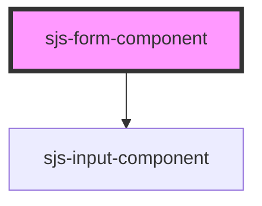

# sjs-form-component

<!-- Auto Generated Below -->

## Properties

| Property                   | Attribute                     | Description | Type      | Default     |
| -------------------------- | ----------------------------- | ----------- | --------- | ----------- |
| `additionalFieldMaxLength` | `additional-field-max-length` |             | `string`  | `undefined` |
| `disableInputFieldGroup`   | `disable-input-field-group`   |             | `boolean` | `false`     |
| `enableValidation`         | `enable-validation`           |             | `boolean` | `true`      |
| `formButtonValue`          | `form-button-value`           |             | `string`  | `'Submit'`  |
| `mainInputFieldMaxLength`  | `main-input-field-max-length` |             | `string`  | `undefined` |
| `onlyNumbers`              | `only-numbers`                |             | `boolean` | `undefined` |
| `signValue`                | `sign-value`                  |             | `string`  | `undefined` |

## Events

| Event             | Description | Type               |
| ----------------- | ----------- | ------------------ |
| `formSubmitEvent` |             | `CustomEvent<any>` |

## Dependencies

### Depends on

- [sjs-input-component](../sjs-input-component)

### Graph

----------------------------------------------

*Built with [StencilJS](https://stenciljs.com/)*
