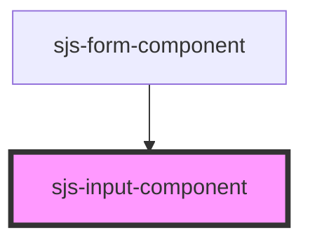

# sjs-input-component

<!-- Auto Generated Below -->

## Properties

| Property                     | Attribute                        | Description | Type      | Default     |
| ---------------------------- | -------------------------------- | ----------- | --------- | ----------- |
| `additionalFieldMaxLength`   | `additional-field-max-length`    |             | `string`  | `'2'`       |
| `allowOnlyNumbers`           | `allow-only-numbers`             |             | `boolean` | `true`      |
| `disableInputFieldGroupFlag` | `disable-input-field-group-flag` |             | `boolean` | `undefined` |
| `inputSignValue`             | `input-sign-value`               |             | `string`  | `undefined` |
| `mainFieldMaxLength`         | `main-field-max-length`          |             | `string`  | `'6'`       |

## Events

| Event                | Description | Type               |
| -------------------- | ----------- | ------------------ |
| `computedInputValue` |             | `CustomEvent<any>` |

## Dependencies

### Used by

 - [sjs-form-component](../sjs-form-component)

### Graph

----------------------------------------------

*Built with [StencilJS](https://stenciljs.com/)*
